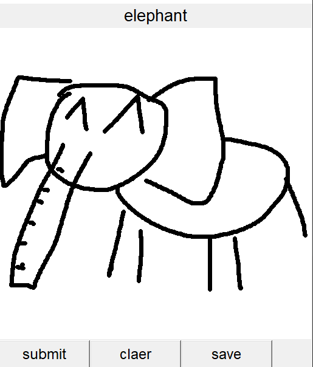
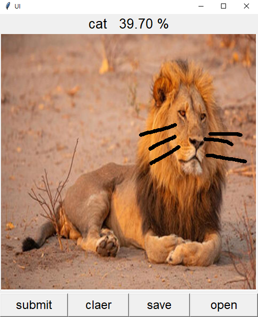

# draw_Identify

## 使用環境

```
 python = 3.6.13
 pytorch = 1.7.1
 beautifulsoup4 = 4.9.3
 requests = 2.25.1
 opencv = 4.5.3.56
 selenium = 3.141.0
```

## Animal

- **cat**
- **dog**
- **elephant**

## demo

### ---ver.1---



### ---ver.2---
add open function and probability of this animal


